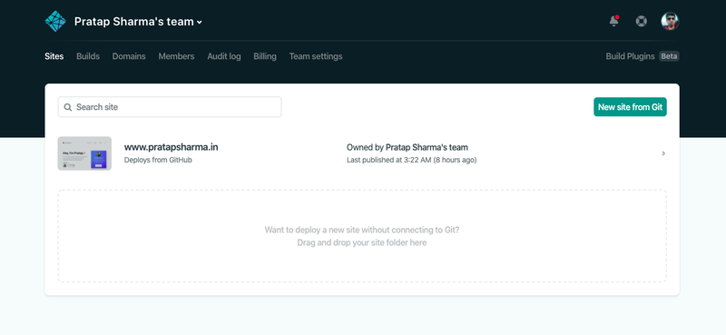
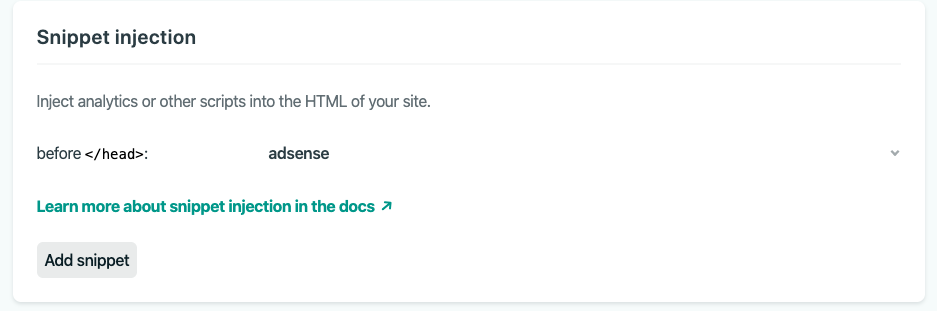
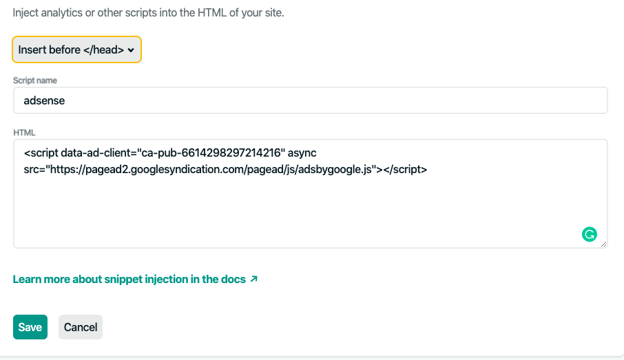

In order to inject adsense snippet into your **Gatsby/React** app which is deployed using **Netlify** follow the below process.

1. Login to your Netlify account here's what it looks like:
   
   Select the site where you want to inject adsense. In my case I'd like to inject into the site `www.pratapsharma.in`.

2. Click on `Site Settings` -> and then on `Build and Deploy` (in the left pane)

3. Scroll down and find `Post processing` -> `Snippet Injection` and then add on click snippet.

   

4. Select the tag from dropdown where you want to insert the script. In our case we'll select `Insert before </head>`. Then give a name `adsense`(you can give any name you like). Finally, paste the link html script which you get from `Google Adsense` in `html text field`. Click on Save.

   

You've successfully injected Google Adsense into Gatsby/React app.

This has worked great for me, and I personally really like this feature. Expecially for site generator like Gatsby which doesn't include a default index.html file where you can include your scripts.
