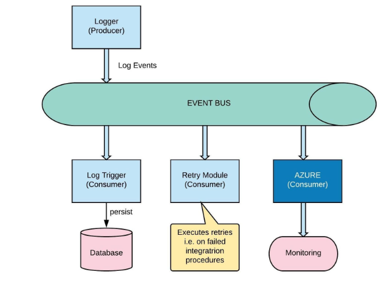
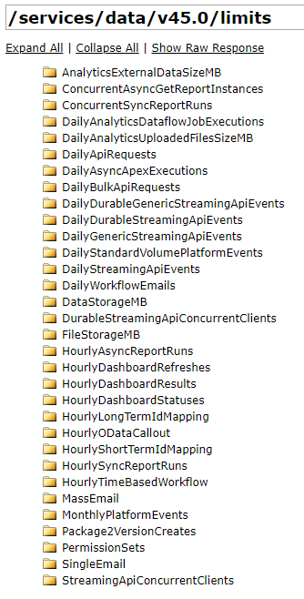
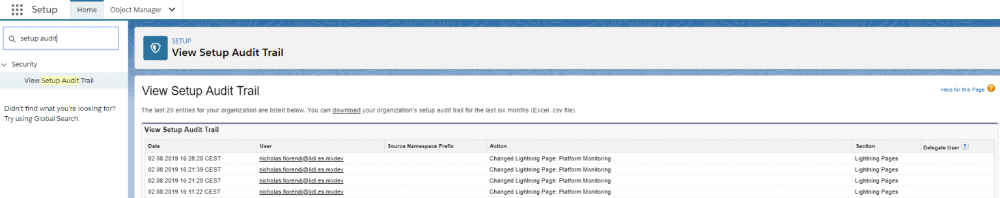
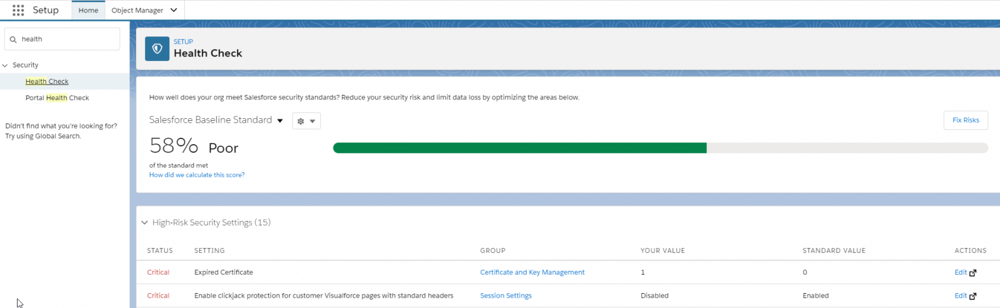
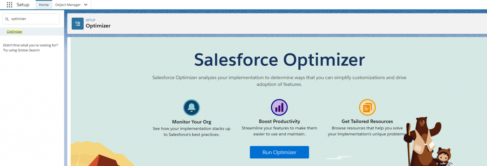
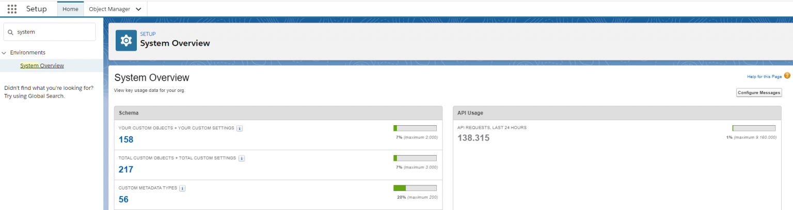
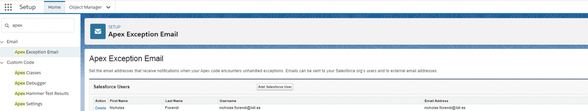
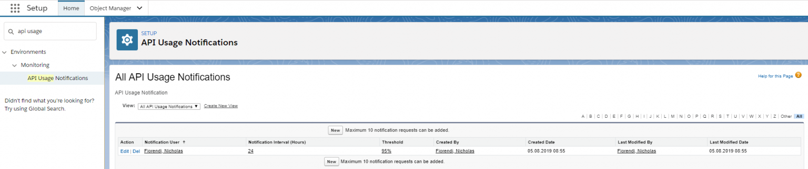
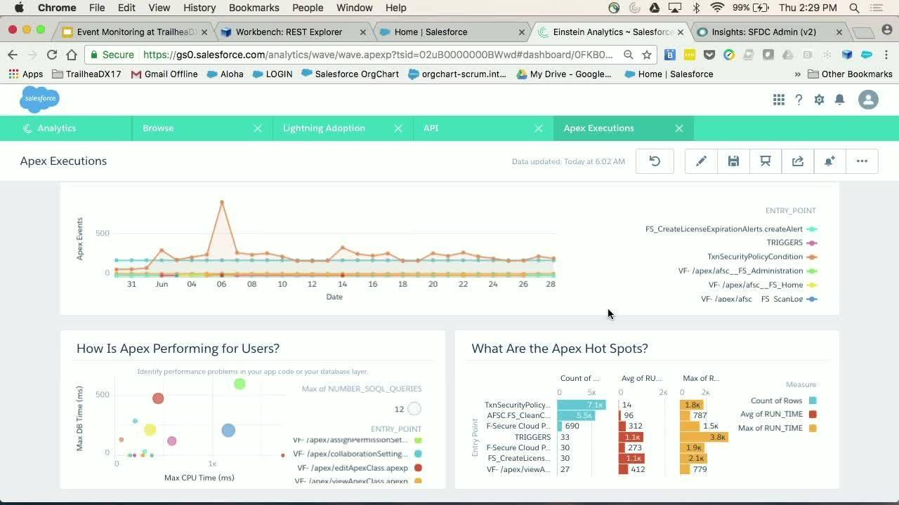
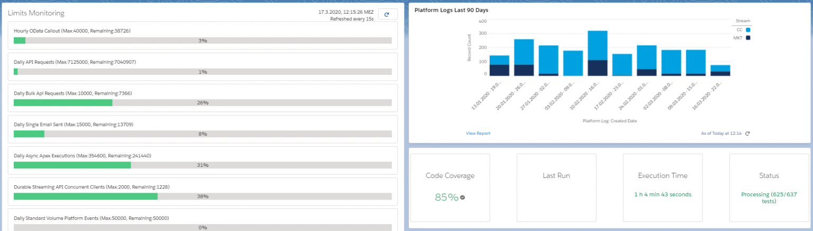

# Diagnose your salesforce org health

## Super Admins

**Ways to check your salesforce org Health.**  
Companies can spend millions on Salesforce and related services, such as sales and service enablement, optimizing processes, materials and technologies, and recruiting top talent – to only name a few! Companies are open to investing in Salesforce beyond the licenses because it positively impacts the productivity of the entire organization. This is why you need to monitor your Salesforce org.

By monitoring your Salesforce org, you’ll be able to identify issues, report them to Salesforce or your own team, and get quicker resolutions. From Apex classes failing, Case create errors troubling your Service Team, to Opportunities that can’t be ‘closed’ because of unmanaged exceptions, it’s vital to set up a proper Monitoring solution. Here are 10 ways I monitor the Salesforce orgs that I work on in order to anticipate implementation breakdowns bfore they actually happen.

# 1. Application Logging Framework
To promote good error handling practices, reuse and provide a framework for handling common coding patterns, the Salesforce Cloud Services team shared a wonderful tool called Application Logging Framework on GitHub, which can be used as framework baseline and extended with Events.

**Custom Setting Exception_Logging** 
 -Setting to define which types of messages to store, how long to store them for, and character cap.

**Custom Setting Integration_Logging** 
 -Setting to define in integration logging in enabled, how long to store them for, and payload stored cap.

**Custom Object Platform_Log** 
 -Object to hold custom logging records.

**Apex Class PlatformLogging** 	
 -Util class to control exceptions and integrations logging.
This framework can be customized and extended to include Events functionalities. Here is an example:

# 2. Tooling API
Use Tooling API to build custom development tools or apps for Lightning Platform applications. Tooling API exposes metadata used in developer tooling that you can access through REST or SOAP. You can use this API to retrieve Apex Code Coverage, Apex Test Result, Entity Limits and other metadata related information. Tooling API Object List

# 3. REST API – Limits
Use REST API to list information about limits in your org:

Max is the limit total for the org.
Remaining is the total number of calls or events left for the org.
This resource is available in REST API version 29.0 and later for API users with the View Setup and Configuration permission.

# 4. Setup Audit Trail
With Setup Audit Trail you can proactively check any metadata change performed by Users in your org.

# 5. Health Check
How well does your org meet Salesforce’s security standards?

Health Check will help you identify gaps in your settings and improve your org security.

# 6. Salesforce Optimizer
Salesforce Optimizer analyzes your implementation to determine ways that you can simplify customizations and drive adoption of features. After analyzing your org, it provides you with an extensive report.

7. System Overview
System Overview provides a summary of key usage data for your org. It’s a one-page dashboard where you can also add system overview messages to your home page. These messages appear when your organization approaches its usage limits.

# 8. Apex Exception Emails
Set the email addresses that receive notifications when your Apex code encounters unhandled exceptions. Emails can be sent to your Salesforce org’s users and to external email addresses.

# 9. API Usage Notification
Define API Usage threshold and get notified when this is exceeded.

# 10. Paid Solutions
Salesforce Shield’s Event Monitoring is a great product to gain access to detailed performance, security, and usage data on all your Salesforce apps. Every interaction is tracked and accessible via APIs, so you can view it in the data visualization app of your choice. See who is accessing critical business data, understand user adoption, troubleshoot and optimize performance to improve end-user experience.

Additionally, on AppExchange there are also other great tools to monitor your org, like Appneta or Catchpoint.

# Summary
It’s clear how important is to monitor your org, and how many possibilities are given by out-of-the-box Salesforce features or paid solutions, if your budget permits.

Many of these functionalities can be also displayed using Lightning Web Components to create a summary dashboard:
  

So, be proactive instead of reactive, and start implementing these controls as soon as possible!

