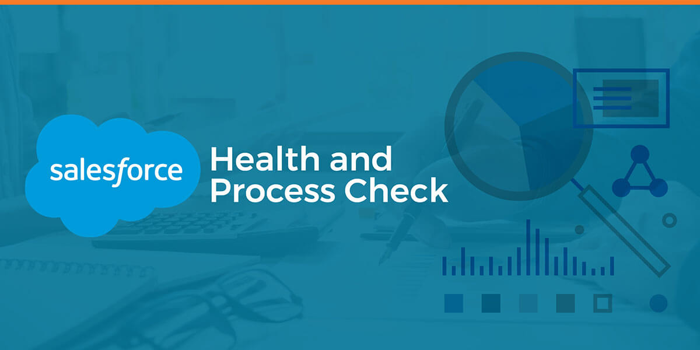

# Meet your salesforce health

## Super Admins

**Ways to check your salesforce org Health.**  
Companies can spend millions on Salesforce and related services, such as sales and service enablement, optimizing processes, materials and technologies, and recruiting top talent – to only name a few! Companies are open to investing in Salesforce beyond the licenses because it positively impacts the productivity of the entire organization. This is why you need to monitor your Salesforce org.

By monitoring your Salesforce org, you’ll be able to identify issues, report them to Salesforce or your own team, and get quicker resolutions. From Apex classes failing, Case create errors troubling your Service Team, to Opportunities that can’t be ‘closed’ because of unmanaged exceptions, it’s vital to set up a proper Monitoring solution. Here are 10 ways I monitor the Salesforce orgs that I work on in order to anticipate implementation breakdowns bfore they actually happen.

# 1. Application Logging Framework
To promote good error handling practices, reuse and provide a framework for handling common coding patterns, the Salesforce Cloud Services team shared a wonderful tool called Application Logging Framework on GitHub, which can be used as framework baseline and extended with Events.

**Custom Setting Exception_Logging** 
 -Setting to define which types of messages to store, how long to store them for, and character cap.

**Custom Setting Integration_Logging** 
 -Setting to define in integration logging in enabled, how long to store them for, and payload stored cap.

**Custom Object Platform_Log** 
 -Object to hold custom logging records.

**Apex Class PlatformLogging** 	
 -Util class to control exceptions and integrations logging.
This framework can be customized and extended to include Events functionalities. Here is an example:

