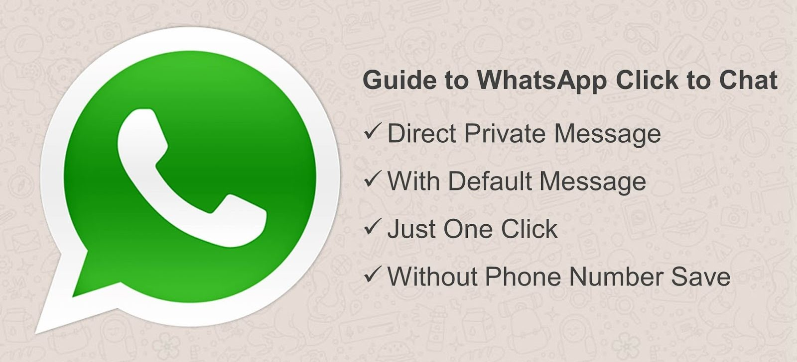

# Click to chat - WhatsApp

WhatsApp's click to chat feature allows you to begin a chat with someone without having their phone number saved in your phone's address book. As long as you know this person’s phone number and they have an active WhatsApp account, you can create a link that will allow you to start a chat with them. By clicking the link, a chat with the person automatically opens. Click to chat works on both your phone and WhatsApp Web.

# Create your own link
Use https://wa.me/<number> where the <number> is a full phone number in international format. Omit any zeroes, brackets, or dashes when adding the phone number in international format.

# Example:

Use: https://wa.me/7004383621

Don't use: https://wa.me/+001-(700)4383621

# Create your own link with a pre-filled message
The pre-filled message will automatically appear in the text field of a chat. Use https://wa.me/whatsappphonenumber?text=urlencodedtext where whatsappphonenumber is a full phone number in international format and urlencodedtext is the URL-encoded pre-filled message.
# Example: 
https://wa.me/7004383621?text=I'm%20interested%20in%20your%20car%20for%20sale
# To create a link with just a pre-filled message:
 https://wa.me/?text=urlencodedtext

Example: https://wa.me/?text=I'm%20inquiring%20about%20the%20apartment%20listing`

After clicking on the link, you’ll be shown a list of contacts you can send your message to.