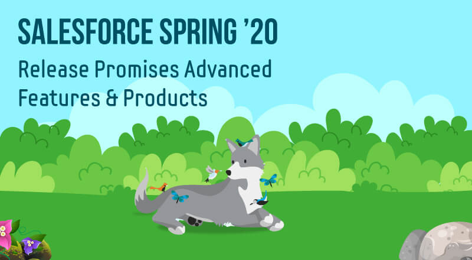

**1. Increase Productivity with Local Development of Lightning Web Components(Beta)** 
- Lightning Web Components now offers Local Development so that you can build component modules and view your changes live without publishing your components to an org. Our new Salesforce CLI plugin lwc-dev-server configures and runs a Lightning Web Components-enabled server on your computer. You can access the local development server from the command line and the Lightning Web Components Extension for VS Code.

**2. Style Lightning Web Components with Custom Aura Design Tokens**
- A Lightning web component’s CSS file can use a custom Aura token created in your org or installed from an unmanaged package. Tokens make it easy to ensure that your design is consistent and even easier to update it as your design evolves.  

  Create a custom Aura token in the Developer Console by creating a Lightning Tokens bundle. For example, this tokens bundle has a custom Aura token called myBackgroundColor.

  Custom Aura tokens aren’t new, but now you can use them in a Lightning web component’s CSS file by using the standard var() CSS function. Prepend –c- to the custom Aura token.  
  **// myLightningWebComponent.css** 
  **color: var(--c-myBackgroundColor);**

**3. Navigate Users to a Record’s Create Page with Default Field Values:**
- Use the new lightning/pageReferenceUtils module or lightning:pageReferenceUtils Aura component to build navigation links in your components that prepopulate a record’s create page with default field values. Prepopulated values can accelerate data entry, improve data consistency, and otherwise make the process of creating a record easier.

**4. The @track Decorator Is No Longer Required for Lightning Web Components:**
- No more guessing about whether to use @track to make a field reactive. All fields in a Lightning web component class are reactive. If a field’s value changes and the field is used in a template or in a getter of a property that’s used in a template, the component rerenders and displays the new value. Click here to read more. 

**5. Use Components in Lightning Communities with Lightning Locker Disabled:**
- To enable components installed from a managed package to run in a community that has Lightning Locker disabled, in the component’s configuration file, use the lightningCommunity__RelaxedCSP tag.

Add lightningCommunity__RelaxedCSP in the new tag of your Lightning web component’s configuration file.

**lightningCommunity__RelaxedCSP**
# Additional features:
**1. Smarter Source Tracking for Lightning Web Components in Scratch Orgs:** 
 – Salesforce command-line interface (CLI) now tracks changes to Lightning web components in a scratch org. The CLI output lists any changes and alerts you to any conflicts between your local project and a scratch org.

**2. Lightning Base Components: Open Source:** 
– Base components for the Lightning Web Components framework are now open source. Explore the source code and customize base components for your own apps.