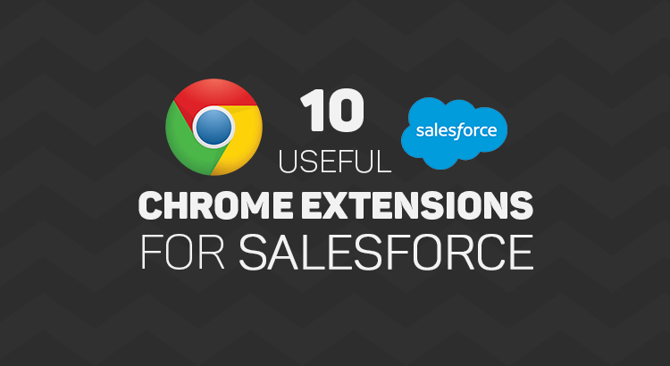

1.[Salesforce API Fieldnames](https://chrome.google.com/webstore/detail/salesforce-api-fieldnames/oghajcjpbolpfoikoccffglngkphjgbo) 
Now getting the API name of the fields is one click away.This saves a lot of time for salesorce consultants/admins/developers to get the API names in one click rather navigating to the object from setup.

2.[Salesforce Colored Favicons](https://chrome.google.com/webstore/detail/salesforce-colored-favico/peohlnebahcddpmfaplmilpkgbkkcdho/) 
This extension is very helpful for those who work in more than one Salesforce org. Forget about having to click into a tab to determine which org you’re in. Just glance at the little clouds floating on your tabs and rest assured that all is well in the multi-org universe.

3.[Salesforce.com Sandbox Favicon Extension](https://chrome.google.com/webstore/detail/salesforcecom-sandbox-fav/nkfllgjejgfgcddfccnijhndhdmjkamf) 
This one is for the Salesforce sandbox and it is same as salesforce Colored Favicons extension. The extension uses the colored favicons, but adds an “S” inside the favicon, so that you can tell that a particular tab is for a Salesforce sandbox org.

4.[Salesforce.com ID Clipper](https://chrome.google.com/webstore/detail/salesforcecom-id-clipper/hfiffenhnefppjhloglpebefjlbhoeai?hl=en) 
This extension helps in getting the 18 digit id directly from the record URl and no need to query to get the 18 digit ID.This is very helpful for the salesforce developers.

5.[Salesforce Navigator](https://chrome.google.com/webstore/detail/salesforce-navigator/ecjmdlggbilopfkkhggmgebbmbiklcdo) 
This extension helps you get to any salesforce page quickly. Just type in what you need to do.All objects list views and create new pages are available (even for objects that don't have tabs).All setup links are available -- Type in "Setup" to see all. 

6.[Salesforce HotKeys (Beta)](https://chrome.google.com/webstore/detail/salesforce-hotkeys-beta/hkpmdgakkflkddmiffelfaokkgoamlil/) 
Adds hotkeys (keyboard shortcuts) to your salesforce record page. Example - CTRL + E for edit, CTRL + S for save and many more! 
This extension provides 2 types of hotkeys:  
★ Hotkeys with CTRL, ALT and SHIFT buttons 
★ GMail like combo keys (#awesomeness) 
This extension will save time that we invest on clicks.

7.[Salesforce.com Quick Login As](https://chrome.google.com/webstore/detail/salesforcecom-quick-login/dccccilgophpadpomgajjlkkioipoojh) 
Makes it easy to login as another user. Maintains the page currently being viewed. 
★Supports Classic and Lightning. 
★Gives a popup of the users listed on the user listing page so you can select to login as a different user on any page. 
★When a user is selected, it logs you in as that user and keeps you on the page you were viewing. 
★When you log out, it will take you back to the page you were originally on when you logged in as the other user.

8.[Salesforce.com Enhanced Formula Editor](https://chrome.google.com/webstore/detail/salesforcecom-enhanced-fo/cnlnnpnjccjcmecojdhgpknalcahkhio/) 
Enhances the formula editor textareas to have syntax highlighting, tabbing, parenthesis matching, and find and replace.
Use this extension to save time and headaches working with formulas. It helps you more quickly understand the structure of a formula, review the fields used by it, and edit the formula.  
When you visit a formula edit page it will automatically enhance the formula textarea with a code editor.  This includes formula fields, validation rule formulas, workflow rule formulas, and field update formulas.
Editor Features Include: 
  Syntax highlighting 
  Tabbing (tab and shift-tab) 
  Parentheses matching 
  Find and Replace 
  No code wrapping 
  Resizing the editor 
  Format button 
  Works with Lightning! 

9.[Grey Tab](https://chrome.google.com/webstore/detail/grey-tab/gdhilgkkfgmndikdhlenenjbacmnggmb) 
A small but growing collection of neat tricks for debugging force.com applications.
This project is open source. You may view the code here before installing it: https://github.com/capeterson/Grey-Tab

Currently supports:
Displaying your current orgId, salesforce hostname, and sessionId (the API-enabled one, not the crippled visualforce SID).

If the page being viewed contains apex:form viewstate data the current size of the data will be displayed as well.

If the page's URL contains an id param or is the standard SFDC record view page then the record details tab will show the raw data behind all fields your user has FLS access to.

10.[Enhance Salesforce Dashboard](https://chrome.google.com/webstore/detail/enhance-salesforce-dashbo/mogildlgjglckdcfclpbcbidpdkjgeeb) 
Do you need real-time information from your Salesforce Dashboards and additional (up to 7) columns of Dashboard components? With this amazing Chrome Extension, now you can!

Salesforce only allows you to refresh Dashboards daily, weekly, or monthly. With Enhance Salesforce Dashboard, you can now have "up to the second" real time information*. Use options to set auto refresh frequency/duration.

Salesforce by default shows only 3 components in one row of a Dashboard. With Enhance Salesforce Dashboard, you can increase the columns up to 7 i.e. show 4 or 5 or 6 or 7 components in one row of a Dashboard. Use options to set number of Dashboard columns.

11.[Salesforce Full Screen Code Editor](https://chrome.google.com/webstore/detail/salesforce-full-screen-co/ogelohfbpibohagmfaalipekmkmpbjai) 
Adapts the code editor window to full screen for best programming experience.

Editor height adapts to screen size 
 Name on page title 
 Support: 
        Apex Classes, Triggers, Components, 
        Visualforce Pages, Email templates 
 Awesomeness also included! 

Press the icon at the url bar to start/exit the fullscreen mode.

12.[Salesforce advanced Code searcher](https://chrome.google.com/webstore/detail/salesforce-advanced-code/lnkgcmpjkkkeffambkllliefdpjdklmi) 
By using the advanced quick find you can get your code few clicks shorter. Also, you can search any string your code
We are now on Lightning!!!!

Using this extension you can search your code components your salesforce instance:
1) apex Classes
2) Apex Triggers
3) visualforce Pages
4) Visualforce Components
5) Lighting Component

In addition to the above you can use this extension to jump to classes / pages / triggers from the advanced quick find section on the left hand side.

How to make it work in Lightning:
1) We embed the extension in the setup page. Please navigate to the setup home page where you can find the extension injected in the right. 
2) You need to authorize (this is a one time activity) for the application to make the API calls. 
3) On clicking the button, you will be navigated to the Salesforce to authorize. Once you have successfully completed the authorization, you will be redirected back to the home page. 
4) Once this is done, all the functionalities will be enabled.

How to use it (Classic):

Both the below section get added in the set-up pages, so this is only useful for developers and Admins, this tool will not make any sense for salesforce users.

1) Advanced Quick Find section:This part gets added in side navigation bar on all set-up pages. Select the code component that you want to go to, then start typing the name of the code,an autocomplete suggestion pops up, select the one that you want to go to.

2) Developer Utilities: 
	2.1) This component get added in force.com home page only. Let's say you want to know where you have hard-coded a profile name in your code, like if(profile.name =='sys Admin'){//you're doing something}. Right now to find this out you have to either go thru all the code individually or create a force.com project in eclipse and then search there. There's no way we can do this directly in salesforce. This string search will help you do that. You have to check the code components in which you want to search the code, enter a string in the input text field and hit enter. You will be presented with a list of code components where the string is used.
	2.2 ) Code Coverage Extract: You can View and download the code coverage in your org.
        2.3 ) This extension now allows you to lint the lightning code via the Lightning Linter tab. 
        2.4 ) You can now run PMD against your code
        2.5 ) Added a new tab which will allow the users to view the record and its child information 