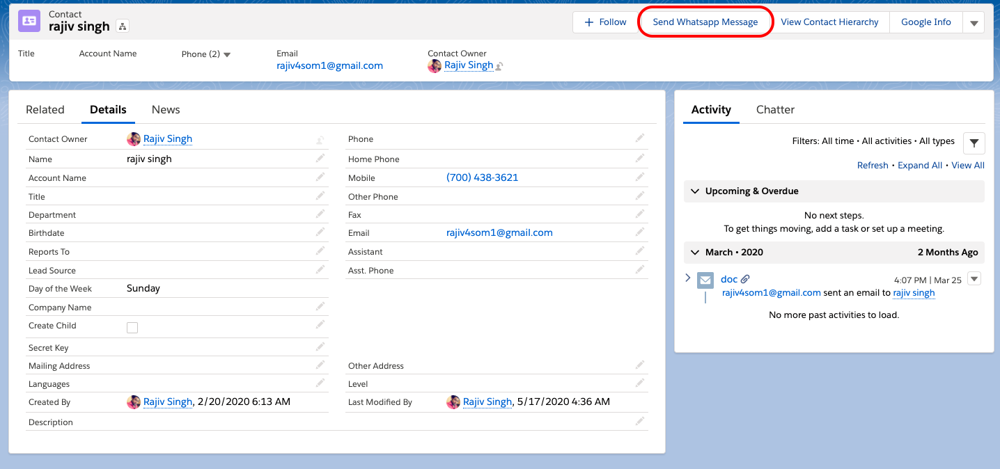
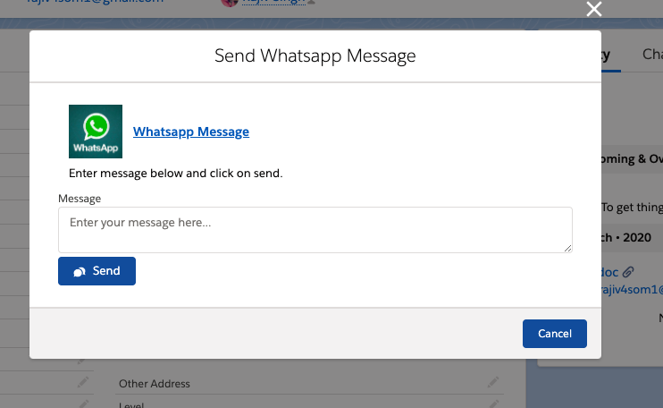
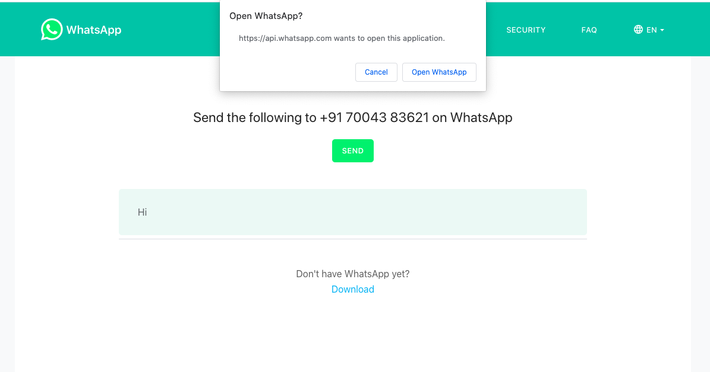

Send whatsapp messages from salesforce using Click to chat feature. A small lightning component has to be created and you cam find the code below.

I have created a quick action on contact object and I am using the lightning component on click of the action button.Lightning component fetches the mobile number on contact and uses click to chat feature of whatsapp to take the message input and call whatsapp API.

Please follow the link to know how to create quick action:
[Quick action in Salesforce](https://trailhead.salesforce.com/en/content/learn/projects/quickstart-devzone-app/devzone-app-3)

**Quick Action on Contact**


**Lightning component to feed message**


**Whatsapp click to chat in action**



 **Find the source code below**

**Lightning Component**
```HTML
<aura:component controller="sendWhatsappMsg" implements="force:appHostable,flexipage:availableForAllPageTypes,flexipage:availableForRecordHome,force:hasRecordId,forceCommunity:availableForAllPageTypes,force:lightningQuickAction" access="global" >
 <aura:attribute name="recordId" type="String" />
    <aura:attribute name="con" type="Contact" />
    <aura:attribute name="msg" type="String" />
    <aura:handler name="init" action="{!c.doInit}" value="{!this}" />
    
    <article class="slds-card">
        <div class="slds-card__header slds-grid">
            <header class="slds-media slds-media_center slds-has-flexi-truncate">
                <div class="slds-media__figure">
                    <span class="slds-icon_container slds-icon-standard-account" title="WhatsApp">
                        
                    </span>
                </div>
                <div class="slds-media__body">
                    <h2 class="slds-card__header-title">
                        <a href="javascript:void(0);" class="slds-card__header-link slds-truncate" title="WhatsApp">
                            <span>Whatsapp Message</span>
                        </a>
                    </h2>
                </div>
            </header>
        </div>
        <div class="slds-card__body slds-card__body_inner">Enter message below and click on send.</div>
    </article>
    <div class="row">
        <lightning:textarea aura:id="myText" name="whatsappText" label="Message" placeholder="Enter your message here..." value="{!v.msg}"/>
        <lightning:button label="Send" iconName="utility:comments" iconPosition="left"  variant="brand" onclick="{! c.sendWhatsApp }" />
    </div>
</aura:component>

```
**JS Controller**
```javascript
({
 doInit : function(component, event, helper) {
        var action = component.get("c.getMobileNumber");
         action.setParams({
            "contactId" : component.get("v.recordId").toString()
        });
        action.setCallback(this, function(response) {
            var state = response.getState();
            var data;
            if(state === 'SUCCESS'){
                var result = response.getReturnValue();
                component.set("v.con", result);
            }
        });
        $A.enqueueAction(action);
 },
    sendWhatsApp : function(component, event, helper){
        var contact = component.get("v.con");
        var msg = component.find("myText").get("v.value");
        var url= "https://wa.me/91"+contact.MobilePhone+"?text="+msg;
        window.open(url, '_blank');
       //Close the Popup after message is sent
        $A.get("e.force:closeQuickAction").fire();
    }
    
})

```
**Apex Class**
```Java

public class sendWhatsappMsg {

    @AuraEnabled 
    public static Contact getMobileNumber(String contactId){
        return [SELECT Id,MobilePhone FROM Contact WHERE Id=:contactId ];
    }
}