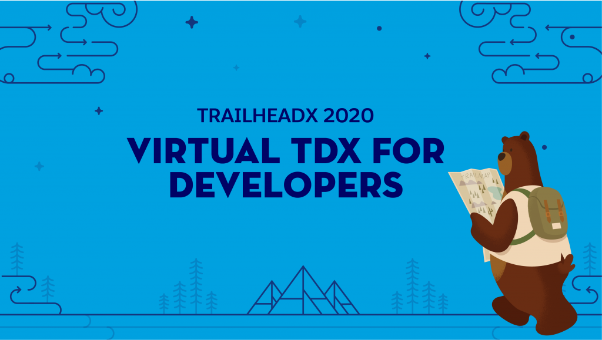

**Virtual keynote focuses on scaling and connecting from anywhere**

1. **Salesforce Anywhere app**

**Salesforce Anywhere** empowers everyone to sell, service, and market from anywhere. And today, with Service Cloud Voice, telephony built right in, and Einstein Call Coaching, it's never been easier to do that. And with **Vlocity** joining the Salesforce family apps for every industry from anywhere: Healthcare, financial services, retail--from anywhere.

Through the app, on desktop or smartphone, users can easily communicate, collaborate, share data, and work together from all across the world. 

**Salesforce Anywhere** is a set of solutions for helping companies move to this all digital, work-from-anywhere world. The employee service solution is integrated within the platform to allow users to work from any location seamlessly.

**Market from anywhere** 
The app, powered by Salesforce Customer 360, allows users to sell, service, and market from anywhere in the world. Utilizing cloud, social, mobile, and artificial intelligence (AI) to build intelligent, personalized experiences for any industry. 

By utilizing apps like Service Cloud Voice and Einstein Call Coaching, organizations can deliver customer success from anywhere. Additionally, Salesforce partnered with **Vlocity** earlier this year, which means data models, APIs, and workflows will be even more industry-specific in the app. 

Centralized call centers can now be geographically distributed teams of agents operating out of their homes. Marketing investments, major trade shows, and physical events can now become targeted, online campaigns."Commerce can shift from brick and mortar to digital storefronts medical care from doctor's offices to telehealth. We see this happening in every industry.

**Collaborate from anywhere** 
The Salesforce Anywhere app, which can be used via phone or desktop, allows for real-time team chat, notification alerts, comments, and video conferencing, right into the Salesforce platform and within the organization's regular CRM workflow.

This is important because it enables people to collaborate from anywhere right within Salesforce in the context of the customer.

Users will be able to see which teammates are working on the same Salesforce page and easily view all record history within the platform. 

**Work from anywhere** 
The growing workforce being remote puts a huge strain on IT help desks, because they need to support their employees and they can't do that in person anymore."To manage this at scale and with security in mind, we want to help employees work from anywhere. So we're announcing a new employee service solution, in partnership with **Tanium**, that will give it teams complete control of all the employee devices and services on their network.

**Tanium** is a leader in endpoint management solution and security, allowing for protected visibility within the Salesforce solution. 

It'll include a help desk for employees to submit tickets, a dashboard for IT managers to view all their assets and incidents in one location.

The service will provide AI-powered recommendations to prioritize incidents for IT managers as well as capabilities for monitoring devices and pushing out updates.

This solution will help IT teams in a couple of ways.

First it's going to help employees access consistent support across every device and channel, including AI-powered bots and mobile self-service sites. "Next, it's going to make IT able to maximize productivity with an integrated help desk, asset management, and workflows to automate and to securely resolve incidents fast."

And finally it will accelerate incident resolution by giving it a complete view of every employee along with AI-powered productivities.

**Data from anywhere**  
The **data from anywhere** component combines the powers of MuleSoft and Tableau to help companies access, process, and gain insights on their data, no matter where that data is.

Users can leverage MuleSoft to unlock and integrate data into an application network using API-led connectivity, widening the data available for review. Organizations can then use **Tableau** to identify insights from up-to-date data, resulting in fast and reliable business decisions, according to a press release. 

**Skills from anywhere** 
Users will be able to gain skills remotely by utilizing the new Einstein recommendations within Trailhead, Salesforce's free online learning platform.

Einstein recommendations, our powerful AI serves up new learning content—or what we call trails and, and badges—based on learners' past behaviors and activities of people similar to them.

Like, if I'm a developer in mobile, it'll show me what other people that do mobile dev have learned as well. And because it's AI, the recommendations improve over time."These algorithms get smarter, making learning more personalized and intelligent than ever before. Think of this as a Netflix of learning, where it has everything that you want right in front of you. 

And Trailhead is also delivering a ton of new resources to address these changing business environments on many topics that companies and individuals need to navigate this new normal, making it easier to skill up from anywhere and meet the business demands that you need to focus on growth. 

The Salesforce Anywhere App will be available in beta in July, with the product expected to be generally available in Q4 of 2020. The employee service solution will be available in beta in November 2020. 

2. **Employee service solution**

Partnering with Tanium, Salesforce announced its employee service solution that helps alleviate the pressure IT teams are under to deliver service to a fully remote team. 

Let's say Monica has a connection issue. In real time, just like she would text a friend, she can chat with an IT chat bot on her phone. This is an intelligent bot powered by Einstein and Flow that can help troubleshoot most common cases.

Through **Tanium**, the agent can see all of the hardware and software assets associated with Monica and can see that her computer is running an older version of the VPN client. The agent is able to securely push the update to Monica's laptop, but wait, there's a notification indicating that others are also impacted by this issue.

An IT agent can securely push the update to all of these users at scale. Boom. Not only have we been able to solve Monica's connectivity issue, but we just proactively solved it for a lot of other people.

3. **Einstein recommendations in Trailhead**

Trailhead, Salesforce's online learning platform, will feature personalized Einstein recommendations to help employees pick the right skills for them. 

These are AI powered recommendations for user, based on the role as a developer. And the cool thing is, the more user uses Trailhead, the smarter and more tailored these recommendations become.

4. **Code Builder**

Code Builder allows developers to build right in their browser.
It can often feel daunting setting up your environment, especially if you just need to write a quick Apex class,With Code Builder a workspace is created in moments with everything you need.

First, we have a custom landing page with links to Trailhead, developer documentation, and even Salesforce samples on GitHub. Because you logged in with your Salesforce org, Code Builder is smart enough to have all of your orgs preauthorized; no need to manually sign-in, simply select which org you want to work against and go.

We set up your workspace with everything you need for Salesforce development, including the Salesforce CLI, the Apex debuggers, custom LWC [Lightning Web Components] and Aura tooling.

