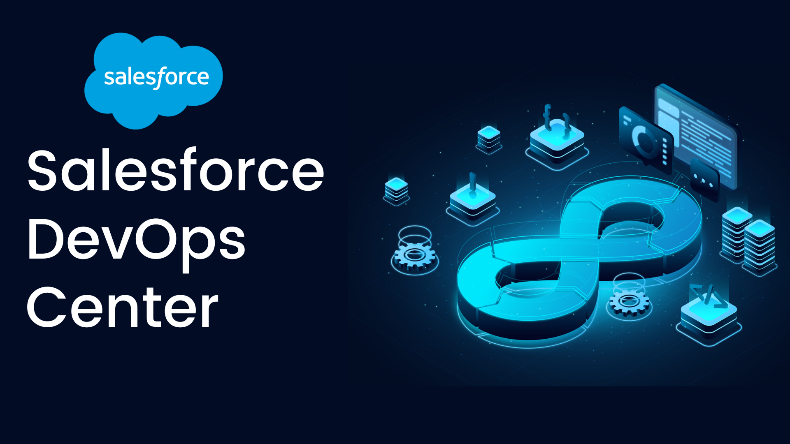
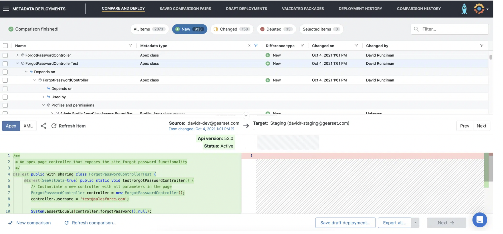
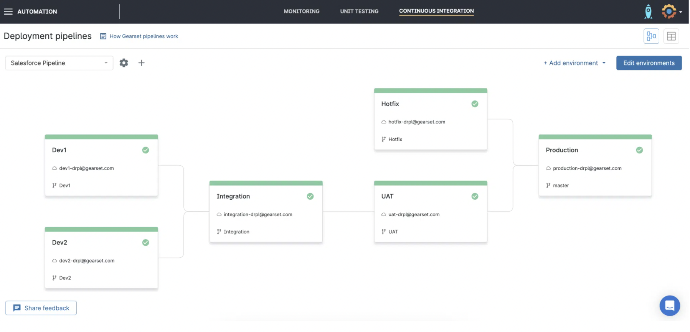
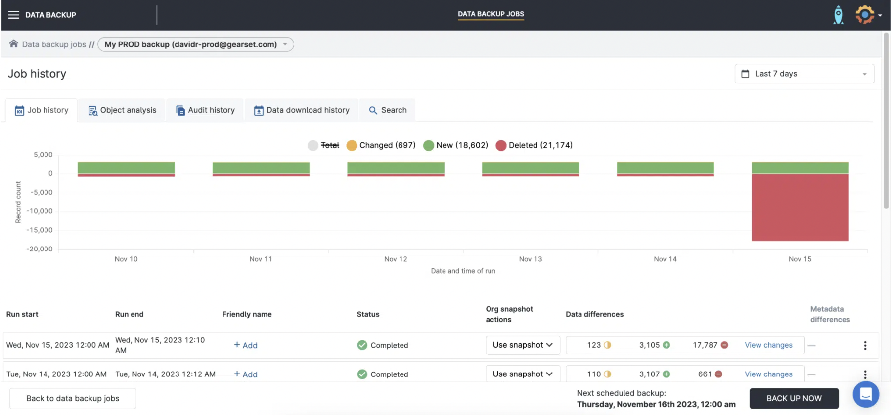

**Making Release Management easy with Gearset**

Salesforce makes a lot of things easy, but release management isn’t one of them. From deployment failure to blocked release pipelines, there are so many release challenges that drive developers to despair.

Over the last few years, thousands of teams have adopted DevOps as a way to overcome these obstacles. DevOps revolutionizes release management on the Salesforce platform, helping trailblazing teams to transform deployments from their worst headache into their secret to success. With agile release cycles, these teams make user-driven development a reality.

Gearset is the go-to DevOps platform for most teams. It solves the fundamental challenge of deployment success, supports DevOps adoption for every team, and offers comprehensive protection for Salesforce orgs.

**Deployments that work first time**

Deployment failure is all too common on Salesforce. You might spend hours wincing at certain metadata types or struggling to decipher error messages. Over the years, Gearset has tackled more and more of these blockers with automated fixes and other smart features. As a result, users have reached a 98% deployment success rate.

Manual deployments in Gearset begin with comparing the metadata between the source and target of your deployment. This gives you full insight into the metadata differences between your orgs  and the dependencies between items. You can deploy selectively — such as individual FLS — to avoid overwriting changes. Having such granular control makes deploying a breeze, even for tricky metadata types like Profiles and Layouts.

Gearset’s problem analyzers run on every deployment package, finding common issues such as missing dependencies or specific problems caused by particular metadata types. Recommended fixes can be accepted at the click of a button.

For developers shipping code, Gearset can detect the relevant unit tests to run for each deployment, based on the Apex classes and their dependencies. Automated unit testing jobs also keep track of your code coverage. 

Tricky deployments are massively simplified with targeted solutions. You can deploy CPQ and Salesforce Industries config data as part of your metadata deployment, release individual pages and components of your Digital Experience sites (Communities), and keep on top of Flow versions.

A full deployment history makes for easy auditing. Deployments in your history can also be combined, redeployed, or rolled back.

Deployment reliability is the foundation for solid DevOps. If you can’t deploy quickly and reliably, advancing to version control and automation is pretty much a non-starter — which is a key reason why teams see more success with Salesforce-specific tools for DevOps.

**Supporting your DevOps journey**

DevOps has gone mainstream for Salesforce development, and the rate of adoption shows no sign of slowing down. There’s been a dramatic shift towards implementing version control and release automation.

Right now there’s a wide range across the ecosystem when it comes to DevOps maturity. Perhaps your team is just starting out with org-to-org deployments. Or perhaps you’re trying to roll out even more automation in an already advanced process. Wherever you are in your DevOps journey, Gearset makes an immediate impact then helps you continuously improve your process.

Adopting version control is an important early step towards proper DevOps. It avoids work being overwritten, improves collaboration and adds resilience to the release process. With Gearset, deploying to Git uses the same workflow as any other deployment — and every Git hosting provider is supported. All this enables no- and low-code developers to join in the DevOps process with clicks not code.

Automation can then be added to build out a reliable CI/CD process, saving manual effort on deployments and testing throughout the pipeline. Gearset makes the power of Salesforce DX available for the whole team, with full support for DX format and the ability to spin up scratch orgs from within its UI.

Advanced teams will create and manage their entire release pipeline in Gearset, so the whole team has complete visibility over the status of every environment. Pull requests into adjacent environments are created automatically, keeping everything in sync.

CI/CD is about stability as well as speed, so testing is essential. You can run unit tests at every stage of the release process, apply static code analysis to ensure code consistency and quality, and integrate with UI testing solutions.

No matter what your process looks like today, it can always be improved. The Gearset team has helped thousands of teams to navigate the shift to DevOps, advising on each step of the journey.

**Security and compliance baked in**

Occasionally, people worry that DevOps is about moving fast and breaking things — that accelerating delivery means going further off track if you head in the wrong direction. The opposite is true. Regularly releasing incremental changes is all about tightening the feedback loop, so you find out right away when something isn’t right. Agile release management is one of the best strategies for protecting your Salesforce orgs.

When issues arise, smaller releases are also simpler to debug, and it’s easier to roll back or roll forward. With Gearset, any deployment can be rolled back — with support for both full and partial rollbacks. Issues in production can be caught quickly thanks to automated testing and monitoring, provided as part of Gearset’s automation toolset. 

Of course, Salesforce resilience isn’t just about release management. There’s growing awareness that the teams responsible for developing on Salesforce need to be involved in backing up and restoring Salesforce. That’s because getting data and metadata into orgs is difficult, and it’s development teams that have the expertise and tools to manage it reliably. Gearset’s comprehensive backup solution makes sure orgs are protected and dramatically reduces recovery times.

Data management and release management also come with compliance requirements. Audit trails are needed to demonstrate who changed what when. Records might need to be removed from all backups. And production data deployed to test environments needs to be masked. Gearset streamlines all of these tasks to ensure compliance with data protection regulations.

Security and compliance have to be a priority when designing development and release workflows. DevOps done right reduces this complexity because security and compliance are baked into automated processes.